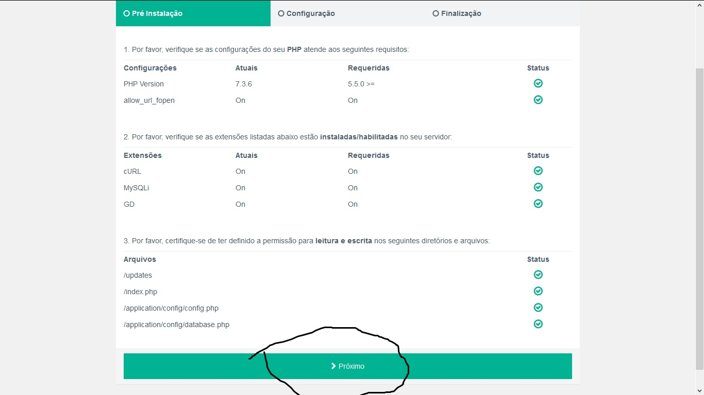

# Map-OS: Instalação em WebServer Linux

- Autor: [Barreto](https://github.com/barretowiisk)
- Última revisão: 2024-11-04

---

## Requisitos

> [!WARNING]
> Este é um passo a passo desenhado e pensado para usuários de sistemas operacionais **Linux** que utilizam uma VPS ou servidor na nuvem.

## Introdução

Este é um guia para que você possa utilizar recursos **Linux** na instalação do seu **Map-OS**.

### Download do Projeto

Para iniciar a instalação, no seu terminal, acesso o caminho de onde de onde deseja armazenar os arquivos do **Map-OS** e baixe o repositório do projeto por meio do [link da última versão](https://api.github.com/repos/RamonSilva20/mapos/releases/latest).

### Instalação via Composer

Com o terminal no local do _webserver_, na raiz do projeto, você pode seguir com a instalação dos recursos necessários, realizando o seguinte commando:

```sh
composer install --no-dev
```

### Instalação do Sistema

Se tudo correu bem até aqui você está preparado para prosseguir com a instalação do sistema no seu servidor. Para continuar:

1. Acesse o seguinte endereço: [`localhost/mapos/`](http://localhost/mapos/).
2. A URL será automaticamente redirecionada para [`localhost/mapos/install/index.php`](http://localhost/mapos/install/index.php)
3. Se não houverem **erros** apresentados, clique em `Próximo`



#### Configuração Básica

Para realizar a configuração básica do sistema, informe as características de acordo com os dados que você criou nas etapas anteriores para o **banco de dados**.

1. Para instalações locais, o endereço do banco deverá ser `localhost`
2. Para sua instalação local, é possível utilizar o usuário padrão para o banco de dados: `mapos`
3. O nome do banco de dados é, por padrão, `mapos`.

A segunda seção de configuração diz respeito ao usuário administrador do sistema, responsável e privilegiado para a configuração da plataforma:

1. Nome de exibição. Ex.: `Ramon Silva`
2. E-mail, que será o seu login.
3. Uma senha segura, que você possa utilizar para acessar o sistema.

> [!NOTE]
> Se você deseja utilizar a API do sistema, este é o momento de habilitar o seu uso. Para instalações locais, este item geralmente não é utilizado.

#### Configuração do E-mail

Para que o sistema possa ser capaz de enviar mensagens por e-mail, você deve realizar a configuração dele no seu acesso.

1. Abra o painel principal e faça o login;
2. Acesse a seção `Configurações > Sistema > E-mail`;
3. Preencha com os dados do seu serviço de e-mail.

#### Configuração de Cron Jobs

O **Map-OS** executa ações de tempos em tempos para que possa enviar mensagens por e-mail com as funções do sistema. Para configurar os `cronjobs`, utilize os dados a seguir:

```sh
# Enviar e-mails pendentes a cada 2 minutos
*/2 * * * * php /var/www/index.php email/process

# Retentativa de e-mails com falha a cada 5 minutos
*/5 * * * * php /var/www/index.php email/retry
```

> [!NOTE]
> O caminho até o arquivo `index.php` varia de acordo com a sua instalação, geralmente localizado na pasta `/var/www/` em servidores **Linux**, mas confira a configuração do seu ambiente.
