# Instalação do MAP-OS (Windows + XAMPP)

- Autor: [Ramon Silva](https://github.com/RamonSilva20)
- Revisor: [Lucas Fogolin](https://github.com/fogolin)
- Última revisão: 2024-11-03

---

## Requisitos

> [!WARNING]
> Este é um passo a passo desenhado e pensado para usuários de sistema operacional **Windows** que utilizam **XAMPP**, com a dependência do **composer** instalada corretamente. Se você não possui ambos os requisitos instalados, executar este guia pode levar a erros no seu sistema.

O Map-OS é uma aplicação web, muito baseada em PHP, de forma que é necessária a utilização de um servidor compatível com interpretação da linguagem para que ele possa rodar adequadamente no seu servidor ou computador. Para continuar, baixe e instale ambas as dependências:

- [Composer](https://getcomposer.org/Composer-Setup.exe)
- [XAMPP](https://www.apachefriends.org/download.html): 7.1 ou superior

## Instalação do Map-OS

> [!CAUTION]
> Este é um guia de **instalação**, não compatível com **atualizações**!

### Preparação

Para poder realizar os procedimentos, deixe o servidor XAMPP rodando (ativo). Você saberá que ele está funcionando corretamente se seu ícone na barra de tarefas do Windows estiver verde. Caso precise se ajuda, consulte este guia: [Como inicio e paro o XAMPP?](https://www.apachefriends.org/pt_br/faq_windows.html).

#### Iniciando o XAMPP

Para iniciar o primeiro requisito, acesse a pasta de instalação do XAMPP (provavelmente `C:\xampp`) e clique duas vezes sobre `xampp-control`. Esta ação levará a uma janela de sistema onde você deverá clicar nos botões `start` ao lado dos serviços **Apache** e **MySQL**:

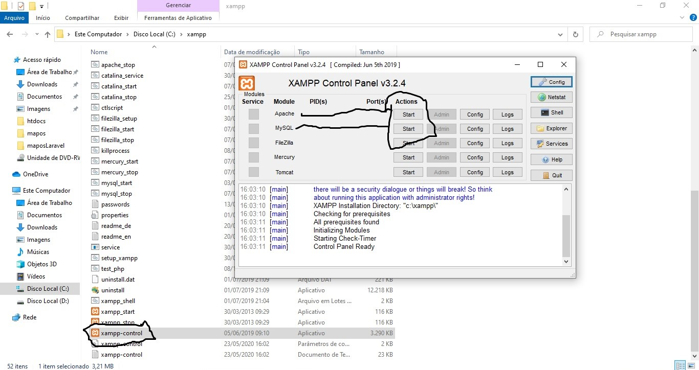

O comportamento esperado depois desta ação é que ambos os nomes dos serviços fiquem **verdes**, indicando que foram iniciados e estão sendo executados sem erros:

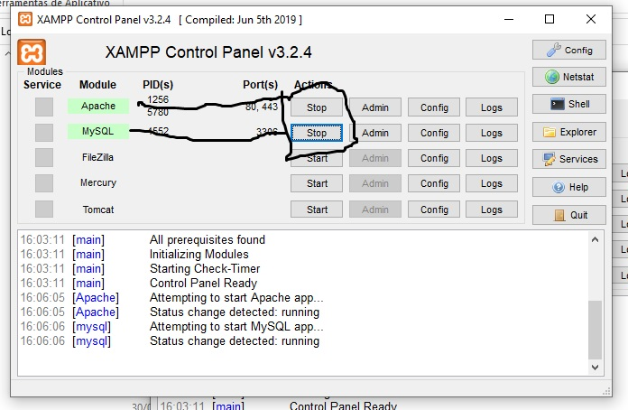

### Baixe o sistema Map-OS

Com o servidor em execução, você pode ir em frente e baixar o sistema **Map-OS** por [este link](https://github.com/RamonSilva20/mapos/releases).

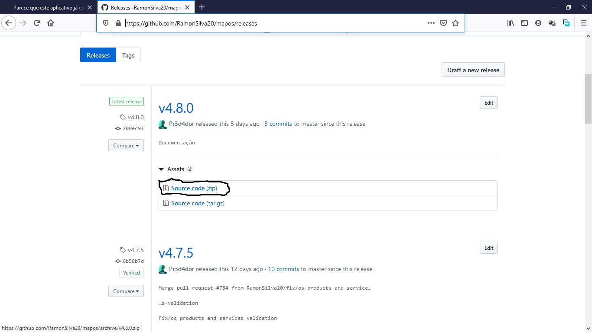

#### Extraindo arquivos do sistema

Para que o servidor **XAMPP** possa interpretar os arquivos do sistema, é necesário extrair eles e inserir na pasta `htdocs` dentro do diretório de instalação: `C:\xampp\htdocs`:

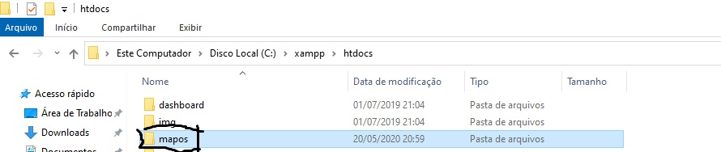

Acesse a pasta `C:\xampp\htdocs\mapos` e, dentro dela, abra um terminal para que possa realizar os procedimentos necessários:

1. Segure a tecla `SHIFT`
2. Clique com o botão **direito** do mouse
3. Escolha a opção _Abrir janela do PowerShell aqui_

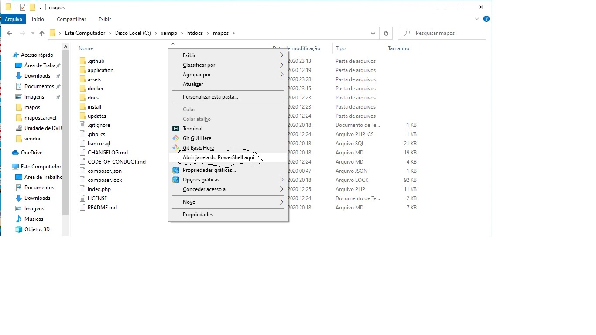

### Instalação via Composer

Com a janela do **PowerShell** aberta, você pode seguir com a instalação dos recursos necessários, realizando o seguinte commando:

```PowerShell
composer install --no-dev
```

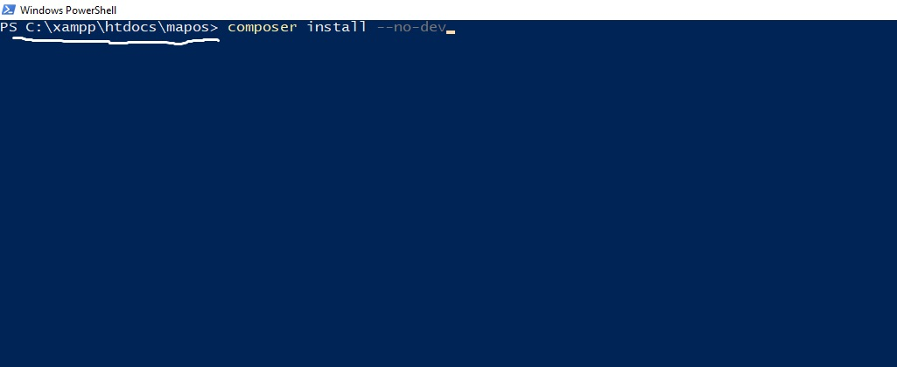

Se tudo estiver adequadamente configurado com o **Composer**, você deve esperar um comportamento semelhante ao da imagem abaixo:

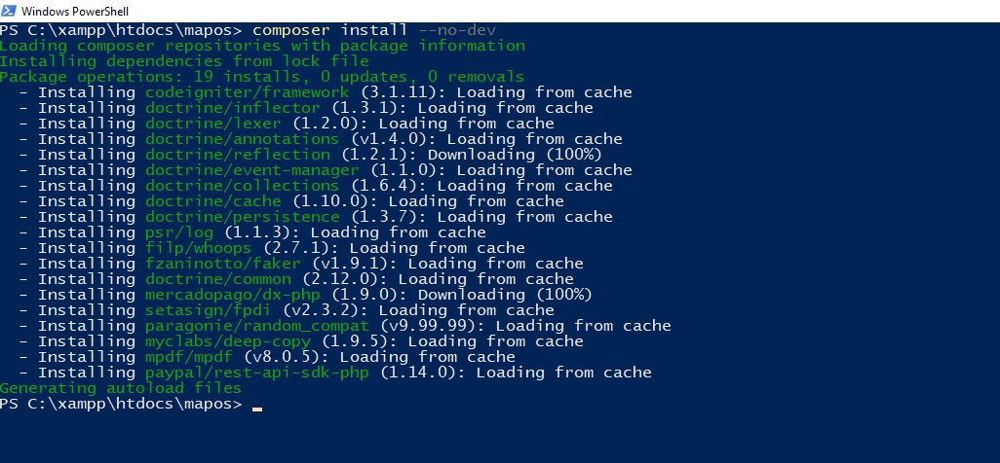

Se houver algum problema, confira se o endereço de onde voc6e está executando o comando está correto e se o **Composer** está instalado e disponível no seu sistema.

> [!NOTE]
> Na imagem acima esta escrito CACHE porque eu já fiz esse procedimento, então ele aproveita os arquivos em CACHE para instalar as dependências.

### Banco de Dados

O Map-OS trabalha com um banco de dados **MySQL**, precisamos criar ele neste momento. Por padrão, o **XAMPP** disponibiliza um acesso para o **PhpMyAdmin**, um serviço de interface com GUI para banco de dados.

No seu navegador, acesse o seguinte endereço: [`localhost/phpmyadmin/`](http://localhost/phpmyadmin/). Em seguida:

1. Seleciona opção `novo`
2. Digite um nome para o seu banco de dados
3. Clique sobre o botão `criar`

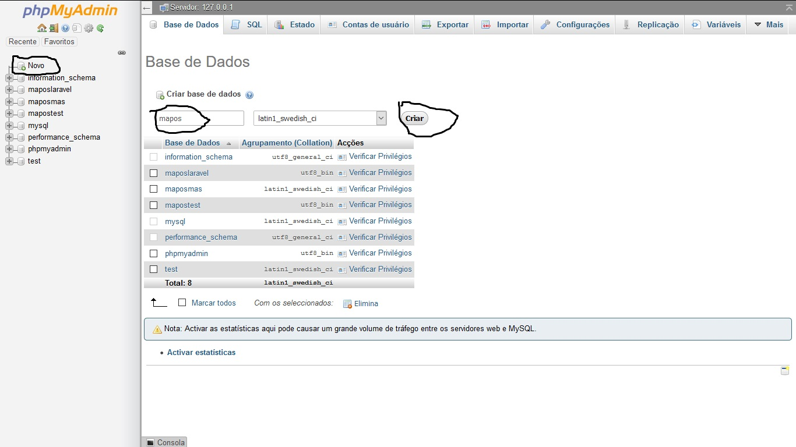

### Instalação do Sistema

Excelente! Se tudo correu bem até aqui você está preparado para prosseguir com a instalação do sistema no seu servidor. Para continuar:

1. Acesse o seguinte endereço: [`localhost/mapos/`](http://localhost/mapos/).
2. A URL será automaticamente redirecionada para [`localhost/mapos/install/index.php`](http://localhost/mapos/install/index.php)
3. Se não houverem **erros** apresentados, clique em `Próximo`


#### Configuração Básica

Para realizar a configuração básica do sistema, informe as características de acordo com os dados que você criou nas etapas anteriores para o **banco de dados**.

1. Para instalações locais, o endereço do banco deverá ser `localhost`
2. Para sua instalação local, é possível utilizar o usuário padrão para o banco de dados: `root`
3. Por padrão, a senha do banco de dados no **XAMPP** não é setada. Neste caso, se você não criou um novo usuário, pode deixar em branco.
4. O nome do banco de dados foi escolhido por você na etapa anterior.

A segunda seção de configuração diz respeito ao usuário administrador do sistema, responsável e privilegiado para a configuração da plataforma:

1. Nome de exibição. Ex.: `Ramon Silva`
2. E-mail, que será o seu login.
3. Uma senha segura, que você possa utilizar para acessar o sistema.

> [!NOTE]
> Se você deseja utilizar a API do sistema, este é o momento de habilitar o seu uso. Para instalações locais, este item geralmente não é utilizado.

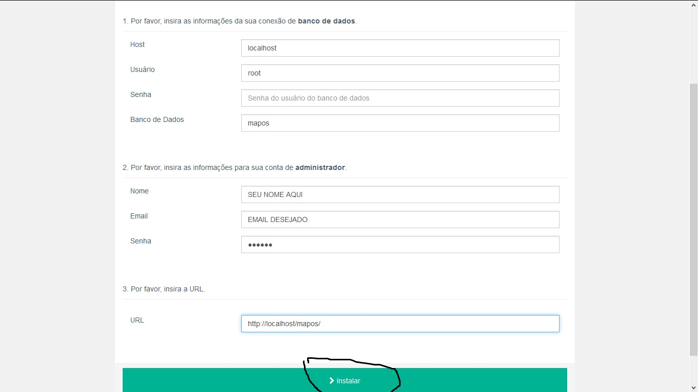

#### Finalização da instalação

Para finalizar a instalação, você pode clicar no botão `Avançar`. Se houver algum problema, você será informado com uma mensagem de erro instrutiva, caso contrário o sistema irá informar que a instalação foi concluida e que você deve remover o diretório de instalação.

Para excluir o diretório, acesse novamente o diretório de instalação do **XAMPP** e remova a pasta `C:\xampp\htdocs\mapos\install`.

Agora você pode clicar em `Finalizar`.

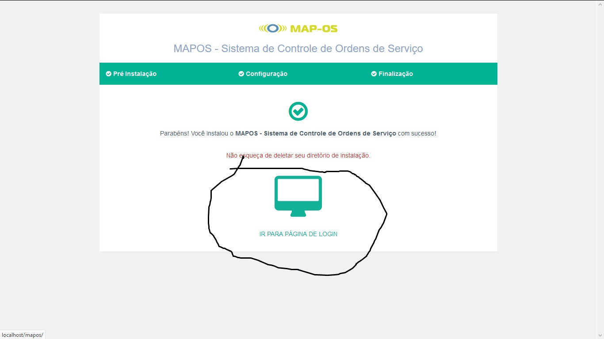

### Primeiro Login

Para acessar o sistema, acesse o endereço [`localhost/mapos`](http://localhost/mapos/index.php/login) e insira as suas credenciais com e-mail e senha escolhidos durante a configuração da plataforma.

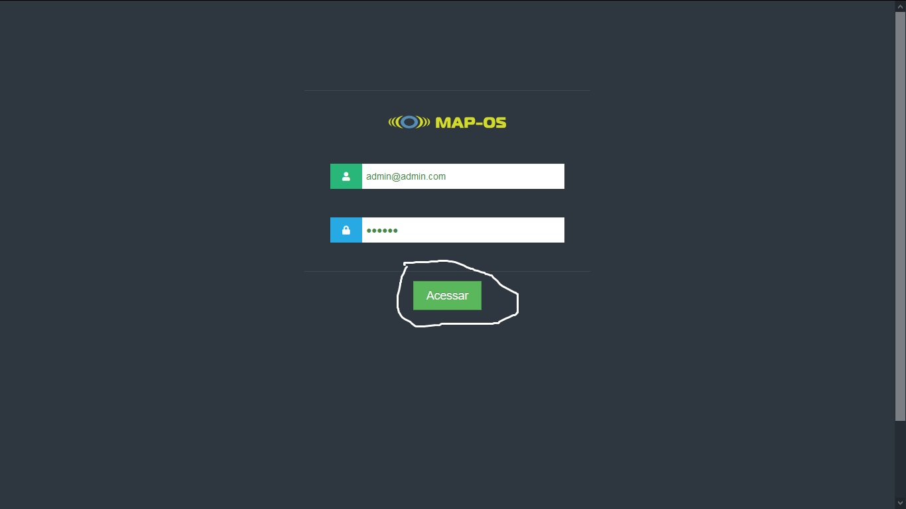

Em seguida, clique em `Acessar` e pronto! Você conseguira utilizar o sistema:

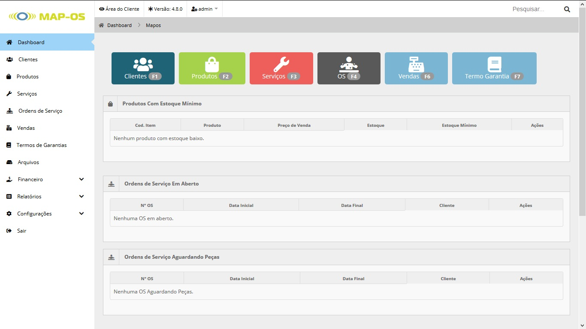
