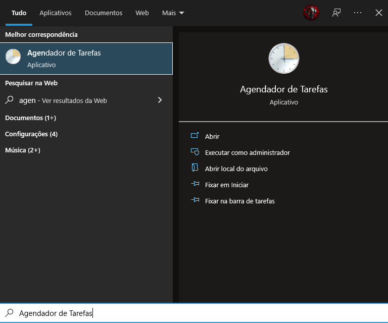
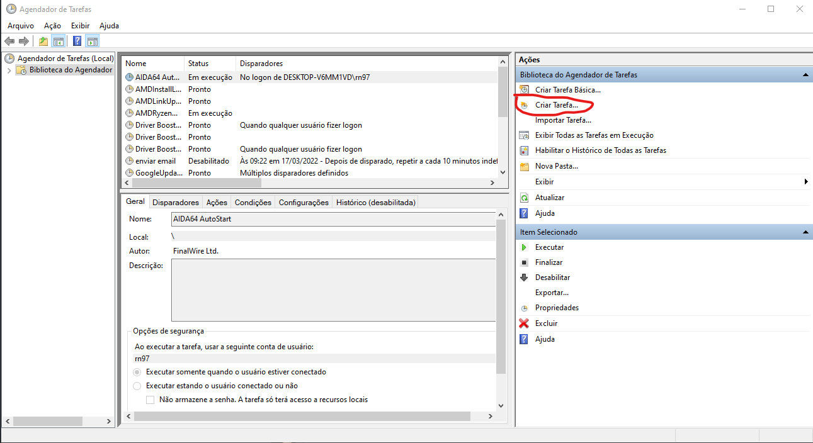
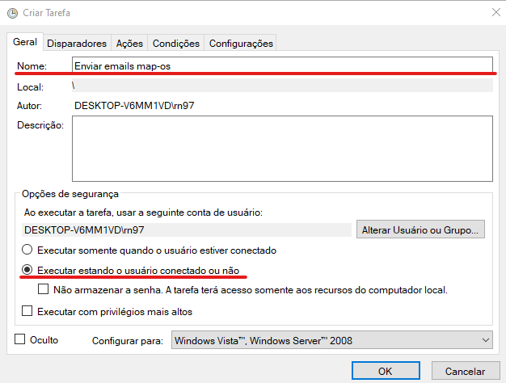
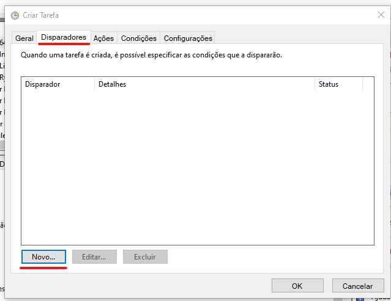
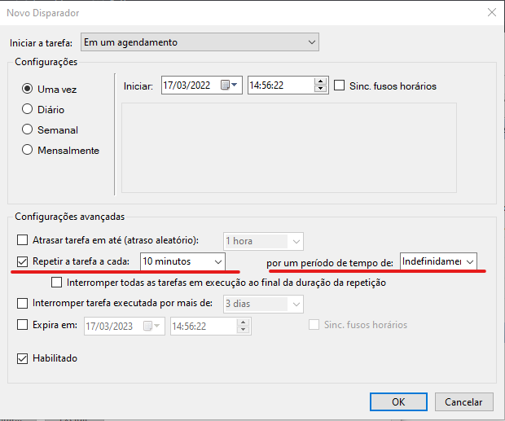
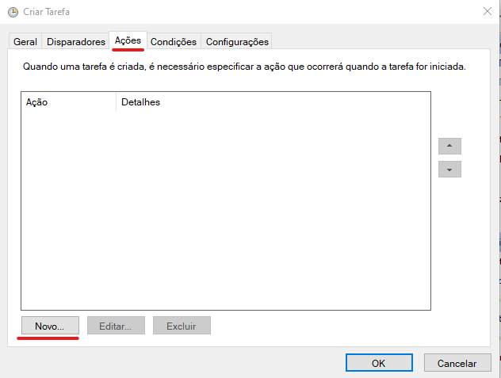
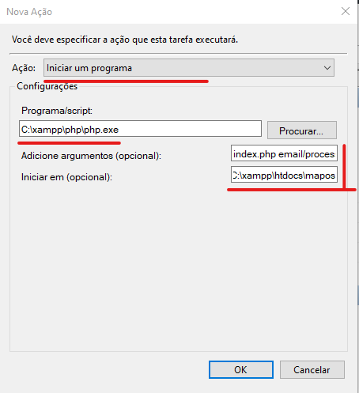
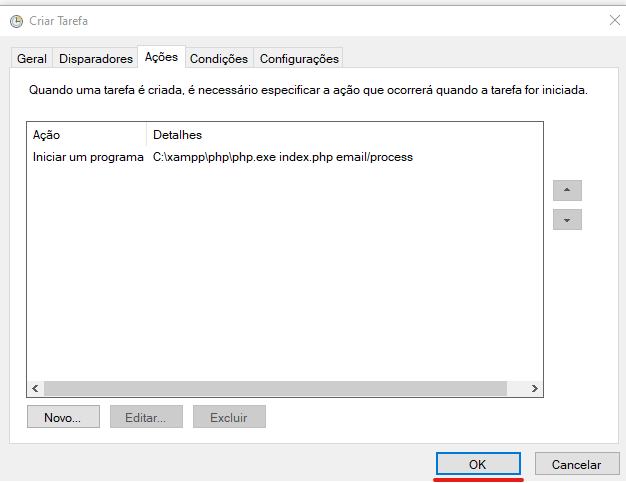
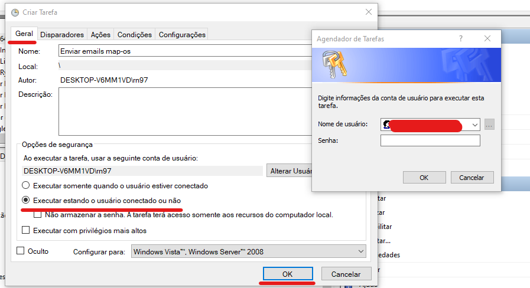
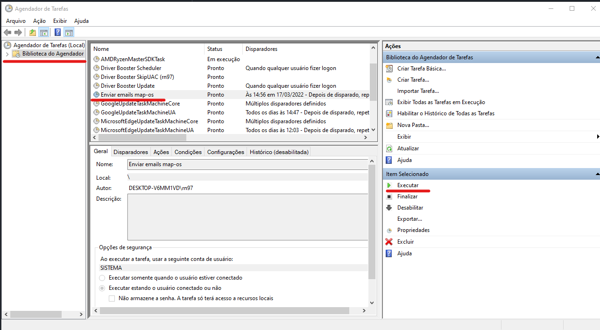

# Cronjobs para Envio de E-mails (Windows + XAMPP)

- Autor: [Luiz Rival](https://github.com/luizrn)
- Revisor: [Lucas Fogolin](https://github.com/fogolin)
- Última revisão: 2024-11-03

---

## Requisitos

> [!WARNING]
> Este é um passo a passo desenhado e pensado para usuários de sistema operacional **Windows** que utilizam **XAMPP**, com a dependência do **composer** instalada corretamente. Se você não possui ambos os requisitos instalados, executar este guia pode levar a erros no seu sistema.

Este guia ensinará você a criar `cronjobs`, isto é, tarefas agendadas, para enviar e-mails do sistema Map-OS utlizando um recurso do próprio **Windows**.

### Agendador de tarefas

Clicando na tecla `Windows` ou abrindo o menu `Iniciar` você pode pesquisar pelo recurso necessário, basta digitar `Agendador de Tarefas`, conforme a imagem:

#### Criando a tarefa

Em seguida, clique no botão `Criar Tarefa`, ou acesse pelas guias superiores, seguindo o menu `Ação > Criar Tarefa`:

A tarefa em questão é a de criar o envio de e-mails, então um bom nome descritivo é `Enviar e-mails Map-OS`, para que você possa identificar com facilidade. Para que não seja aberta uma janela do terminal todas as vezes que a ação for executada, certifique-se de marcar a opção `Executar estando o usuário conectado ou não`. Esta opção isrá exigir que você insira os seus dados de login do **Windows**:

#### Disparando a tarefa

No menu superior, escolha a opção `Disparadores` e, em seguida, `Novo`:

Em seguida, escolha as opções para o seu agendamento. Aqui você pode escolher como o agendamento ocorrerá, com que frequência e em qual intervalo de tempo. Escolha as opções que são mais adequadas para o seu caso de uso. No nosso exemplo, escolhemos:

- Iniciar a tarefa: `Em um agendamento`
- Configurações: `Uma vez`
- Iniciar: `17/03/2022 às 14h56`
- Configurações avançadas:
  - Repetir a tarefa a cada: `10 minutos`
  - Por um período: `Indeterminado`
- Marque a opção para **habilitar** o agendamento
- Clique em `OK`

### Configurando as ações

Agora que o agendamento está configurado, vamos ecsolher que ações deverão ser executadas quando ele ocorrer. Na guia de **Ações**, clique em `Novo`

Nesta janela, você pode configurar ações específicas que gostaria que acontecessem no seu agendamento. Para este exemplo:

- Ação: `Iniciar um programa`
- Progama/Script: `C:\xamp\php\php.exe`. Este é o caminho padrão onde se pode encontrar o serviço do PHP no diretório de instalação do **XAMPP**.
- Adicione argumentos: `index.php email/process`. Este é o comando para que o **Map-OS** processe a fila de e-mails.
- Iniciar em: `C:\xampp\htdocs\mapos`
- Clique em `OK`

### Concluindo a tarefa

Uma vez configuradas as ações desejadas, você pode clicar no botão `OK` para criar a tarefa.

#### Autenticação complementar

> [!IMPORTANT]
> Se você optou por selecionar a configuração `Executar estando o usuário conectado ou não`, será necessário incluir suas informações de login.

Para que você possa concluir e salvar a sua tarefa agendada, o **Windows** poderá pedir uma autenticação complementar, por meio de:

- Uma credencial de login Windows
- Uma opção em uma listagem de usuários
- Possivelmente não será solicitada senha adicional

Se mesmo após preencher os dados solicitados você ainda enfrentar dificuldade, com mensagem de erro informando que o processo não pôde ser executado, é possível que você não tenha permissão para realizar a tarefa com o usuário desejado. Nestes casos, volte nas configurações e desmarque a opção `Executar estando o usuário conectado ou não`., que serve para que não seja carregada uma janela de terminal todas as vezes que o agendamento for executado.

Caso o usuário não seja de fato aceito, clique na opção `Alterar usuário ou grupo` e, na janela que se abre, no último campo, escreva `User` ou `sistema` para, em seguida, poder verificar os nome:

#### Testando o agendamento

Se tudo deu certo até aqui, você não precisa aguardar o prazo para a execução do agendamento, basta clicar com o botão direito sobre a tarefa e escolhe a opções `Executar`:

Para conferir no **Map-OS** se a sua fila foi executada, acesse no painel do sistema a opção de `Configurações > E-mails` e confira o `Status`: se o estado não for **Pendente**, significa que o agendamento foi executado pelo **Windows**.

Caso o `Status` esteja identificado com **Falhou**, possivelmente o problema está na sua configuração de `SMTP`.

### Retentativas

Por fim, você pode criar outra tarefa para o comando `index.php email/retry`, que serve para reenviar e-mails que foram identificados com erros ou, por algum outro motivo, que não foram enviados. Basta seguir os mesmos passos deste guia, somente alterando conforme o passo onde há a opção `Adicione argumentos`.
